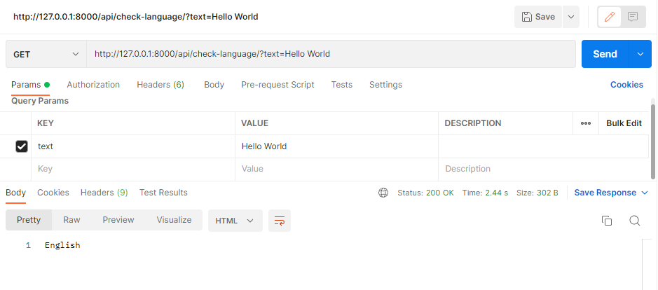
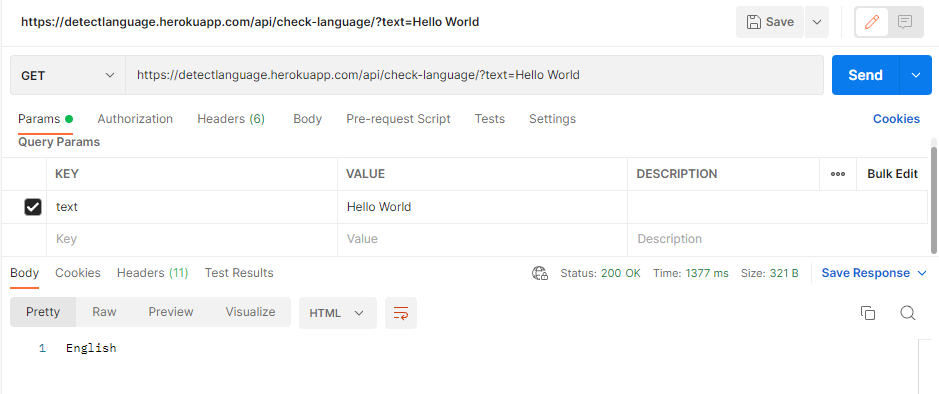
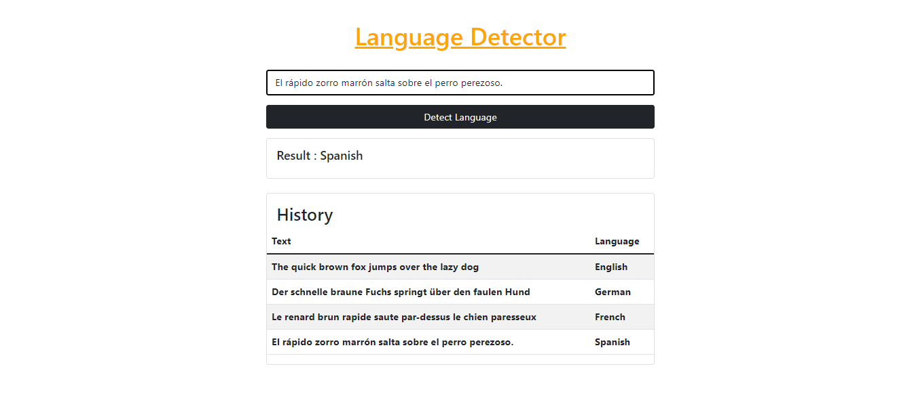

# Language Detection Web Application Using NLP
<!-- Replace the "RENAME_ME_WITH_YOUR_PROJECT_TITLE" in the text above with your project Title -->
Course: **CSE 702 - Artificial Intelligence Lab**            
Offered for: Session *2017-18*, Dept. of CSE, SEC
### Group \# **13**
<!-- Replace the "00" in the text above with your project group number. It should be anything between 01 to 25 -->
Group Name: **Team Candy**

## Contributors' Info
<!-- Fill the blanks with your information. change the last two letter of the registration numbers with the respective digits. Correct the "Session" if needed. -->
|                 |  Member 1  |  Member 2  |
| --------------: | :--------: | :--------: |
|            Name |      Sakib Alam Snigdha      |     Md. Masum Billah       |
| Registration \# | 2017331501 | 2017331531 | 
|         Session |  2017-18   |  2017-18   |
| GitHub Username |        SA-00001    |      masumbillah3416      |
|            Cell |      01798022129      |      01718988564      |
|           Email |      sakibalamsnigdha@gmail.com      |      masumbillahsujon1998@gmail.com      |

Supervisor
-----------
**Enamul Hassan**         
Assistant Professor     
Department of Computer Science and Engineering          
Shahjalal University of Science and Technology       
[Faculty Profile](https://www.sust.edu/d/cse/faculty-profile-detail/590) and [GitHub Profile](https://github.com/enamcse)

## Project Idea
### Motivation 
<!-- Describe here why this project is being done. -->
Language identification is the task of recognizing a language by looking at text or listening to speech. It is one of the most challenging, yet incredibly relevant tasks in computational linguistics. Well-performing systems are necessary for both conducting linguistic research and creating various applications that work with linguistic data. In this work we only focus on recognizing textual instances. The task of language identification is aimed at recognizing all possible natural languages. The language communities are often under-resourced, and without language recognition systems they are slowed down in their progress in developing various instruments for researching the respective languages. But all the available language recognition system incurr a fee for using their services which hampers a lot of aspiring people in their work. We intend to make it open source for anyone to use and add more languages. We collect online resources for as many languages as possible.
### Scope
<!-- Describe the domain space of the project. -->
This project will include collecting datasets, creating models for training, training the model, use the model in the application, publish the application for the public. The source code with be made open source on github for further development.
### Platform
<!-- What is the environment requirement of the project? What is the OS? Is it for mobile, web, or general API? -->
Type: Web based Application

Environment: Visual Studio Code, Github, Pycharm

Languge: Python, Django, Javascript
### Project Brief
<!-- Describe the project in brief. -->
This will be an web based text language detection system that will detect the language of the text. 
## Project Deliverables
<!-- This table should reflect what are you going to submit. How your progresses would be visible. Note that, you have to create a corresponding issue in the GitHub issue to submit the work of any milestone. -->
<table>
<thead>
    <tr>
        <th>SL</th>
        <th>Milestone</th>
        <th>Details</th>
        <th>Comments</th>
        <th>Expected Submission Date</th>
        <th>Submission Date</th>
    </tr>
</thead>
<tbody>
    <tr>
        <td> 1 </td>
        <td>40% Completion</td>
        <td>
        <ul>
            <!-- Change the following list with your project's checklist for 40% Completion. The following texts have no significance and it is put here just for beautifying. -->
            <li>Determining project scope, environment</li>
            <li>Research paper analysis</li>
            <li>Features and useability</li>
            <li>Collecting sample Datasets</li>
            <li>Model development initialization </li>
        </ul>
        </td>
        <!-- Initially make the following text empty. You have to fill it in the time of submission. -->
        <td>
            Further development is required.  The number of datasets collected is not sufficient to train the model. Hence, more datasets are required. Libraries like  Scikit-Learn, and Pandas are required to train the model. The model will be trained on the collected datasets. 
        </td>
        <!-- The following is the estimated submission date for this milestone. Change it as your need. -->
        <td>May 10, 2022</td>
        <!-- Initially make the following text empty. You have to fill it in the time of submission. -->
        <td>May 10, 2022</td>
    </tr>
    <tr>
        <td> 2 </td>
        <td>70% Completion</td>
        <td>
        <ul>
            <!-- Change the following list with your project's checklist for 70% Completion. The following texts have no significance and it is put here just for beautifying. -->
            <li>Complete Dataset collection</li>
            <li>Model development</li>
            <li>Model training</li>
            <li>Model testing</li>
            <li>Model evaluation</li>
        </ul>
        </td>
        <!-- Initially make the following text empty. You have to fill it in the time of submission. -->
        <td>
            Model development is completed with the collected datasets. The model is trained on the collected datasets. Testing and evaluation  are completed.
        </td>
        <!-- The following is the estimated submission date for this milestone. Change it as your need. -->
        <td>May 20, 2022</td>
        <!-- Initially make the following text empty. You have to fill it in the time of submission. -->
        <td>June 7, 2022</td>
    </tr>
    <tr>
        <td> 3 </td>
        <td>100% Completion</td>
        <td>
        <ul>
            <!-- Change the following list with your project's checklist for 100% Completion. The following texts have no significance and it is put here just for beautifying. -->
            <li>Create Api using trained model</li>
            <li>Publish Api</li>
            <li>Create Frontend Application</li>
            <li>Publish Frontend Application</li>
            <li>Application testing and debugging </li>
            <li>Technical, non-technical Documentation </li>
            <li>Create presentation slide </li>
        </ul>
        </td>
        <!-- Initially make the following text empty. You have to fill it in the time of submission. -->
        <td>
            Model trained and tested (80:20) using 180657(English), 147251(French), 161805(German) and 159260(Spanish) datasets.
         </td>
        <!-- The following is the estimated submission date for this milestone. Change it as your need. -->
        <td>June 10, 2022</td>
        <!-- Initially make the following text empty. You have to fill it in the time of submission. -->
        <td>June 10, 2022</td>
    </tr>
</tbody>
</table>

## Project Presentation Slide
<!-- Upload the project presentation slide in GitHub in pdf format and drop a link here. The current link is a dummy one. -->
[Here](https://docs.github.com/en/get-started) is the presentation slide of the project.

Technical Documentation/ Instruction to Deploy the Project
----------------------------------------------------------
<!-- Write a detailed documentation for a technical user who want to DEPLOY your project. It should be as detailed as possible. You can add a FAQ section if needed where basic troubleshooting questions should be answered. Adding Screenshot is appreciated. -->
- Model Training

    1. Download and Install Python from [this](https://www.python.org/downloads) website.
    2. Models Codes are inside `language_detection` folder.
    3. install the libraries using `pip install -r requirements.txt`
    4. Datas are inside `language_detection/datasets` folder.
    5. This dataset contains the following languages:
        - English (en)
        - French (fr)
        - German (de)
        - Spanish (es)
    6. Run the code using `python main.py` .
    7. Trained model will be saved as `language_detection/LanguageDetectModel.pckl` file.
    8. check single text using `python single.py`

- Django Application

    1. Download and Install Python from [this](https://www.python.org/downloads) website.
    2. Django application is inside `api_application` folder.
    3. install the libraries using `pip install -r requirements.txt`
    4. Trained model file is placed in `api_application/model` folder.
    5. Run the code using `python manage.py runserver` .
    6. check single text using `http://localhost:8000/api/check-language/?text=Hello%20World`.
    7. Here is [Postman](https://www.postman.com/downloads) demo for the API:
    
     
    8. This project is also deployed on Heroku. Here is <a href="https://www.postman.com/downloads">Postman</a> example: 
    

- Angular Web Application
    1. Download and Install Nodejs from [this](https://nodejs.org/en/download) website.
    2. Install Angular CLI using `npm install -g @angular/cli` command.
    3. Angular application is inside `web_application` folder.
    4. Install the libraries using `npm install` command.
    5. To change the api url, in the `web_application/src/app/detector.service.ts` file, change in  line `12` with corresponding url.
    6. Run the code using `ng serve` command.
    7. Check web application using `http://localhost:4200/`
    8. here is the demo of the web application:
    
     
    9. This application is deployed on  <a href="https://vercel.com">Vercel</a>. Here is the <a href="https://language-detection.vercel.app">link</a> of the website.

Non-Technical Documentation/ User-guide for the End-Users of the Project
------------------------------------------------------------------------
<!-- Write a detailed documentation for a non-technical user who want to USE THE FEATURES of your project. It should be as detailed as possible with proper screenshots. You may add a FAQ section if needed where common questions should be answered. Adding Screenshot is MUST. -->
1. Go to `https://language-detection.vercel.app` in your browser and observe a page like the following screenshot. If it is not found, contact the administrator.

2. Input any text from following language:
    - English (en)
    - French (fr)
    - German (de)
    - Spanish (es)

3. Click on the button `Detect Language` and observe the result.
4. Results of current session will be saved in `History` section.

Acknowledgement
---------------
<!-- You should acknowledge every external help here. A table could be a good option. From Stackoverflow question to any conference/journal paper everything should be mentioned including its use in your project. You should include the contribution of your friend if you take it from anyone. -->

Paper 1:

    Gebre, Binyam Gebrekidan, et al. "Improving native language identification with tf-idf weighting." Proceedings of the Eighth Workshop on Innovative Use of NLP for Building Educational Applications. 2013.

Paper 2:

    Remnev, Nikita. "Native Language Identification for Russian." 2019 International Conference on Data Mining Workshops (ICDMW). IEEE, 2019..

Dataset:

- The source of the language dataset is <a href="https://statmt.org/wmt11/translation-task.html#download">Machine translation of Europian Languages</a>.

Youtube Videos:
- Deployment `Django` application on `Heroku` by <a href="https://www.youtube.com/watch?v=V2rWvStauak">Code Band</a>
- `Django API` tutorial by <a href="https://www.youtube.com/watch?v=rHux0gMZ3Eg">Programming with Mosh</a>
- Deployment `Angular` application on `Vercel` by <a href="https://www.youtube.com/watch?v=V2rWvStauak">How To Do It</a>

Friend:
- Frontend developement guided by <a href="https://github.com/shibli21">Syed Shibli Mahmud</a> 

Disclaimer and Non-Disclosure Agreement (NDA)
---------------------------------------------
<!-- In the following TWO pairs of square brackets, put an 'x' without quotes after reading and accepting the statements. -->
- [ ] This is to certify that this project is done by the *Contributors* mentioned above and nothing is hidden from the supervisor. The external resource(s) used here is/are properly acknowledged above. If any proof of falsifying is found, then the supervisor and the corresponding authority would take the necessary actions.
- [ ] This is to certify that the above mentioned *Contributors* are fully responsible for the confidentiality of the project. Any part of the project would NOT be shared publicly or privately without the prior permission of the supervisor mentioned above even after the publication of the result. If anything else happens, then the supervisor and the corresponding authority would take the necessary actions.

<!-- Thank you so much. -->